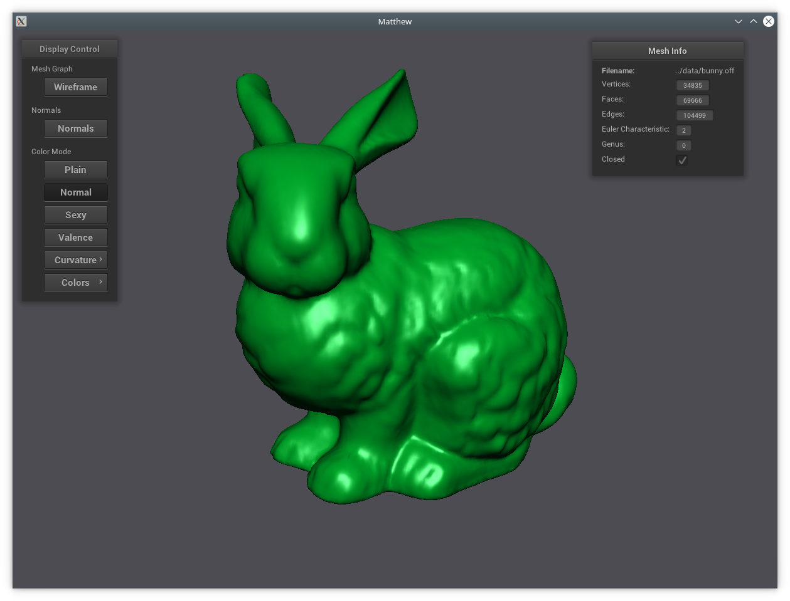
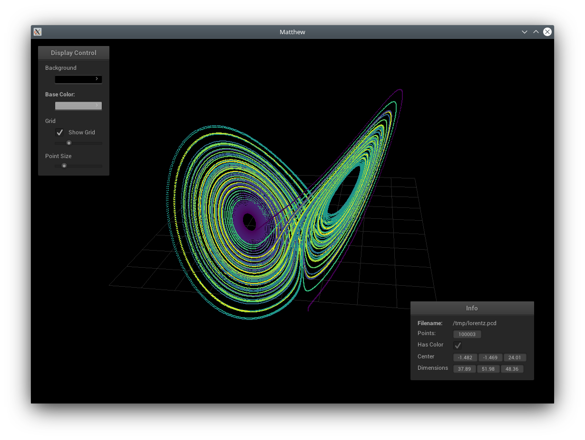
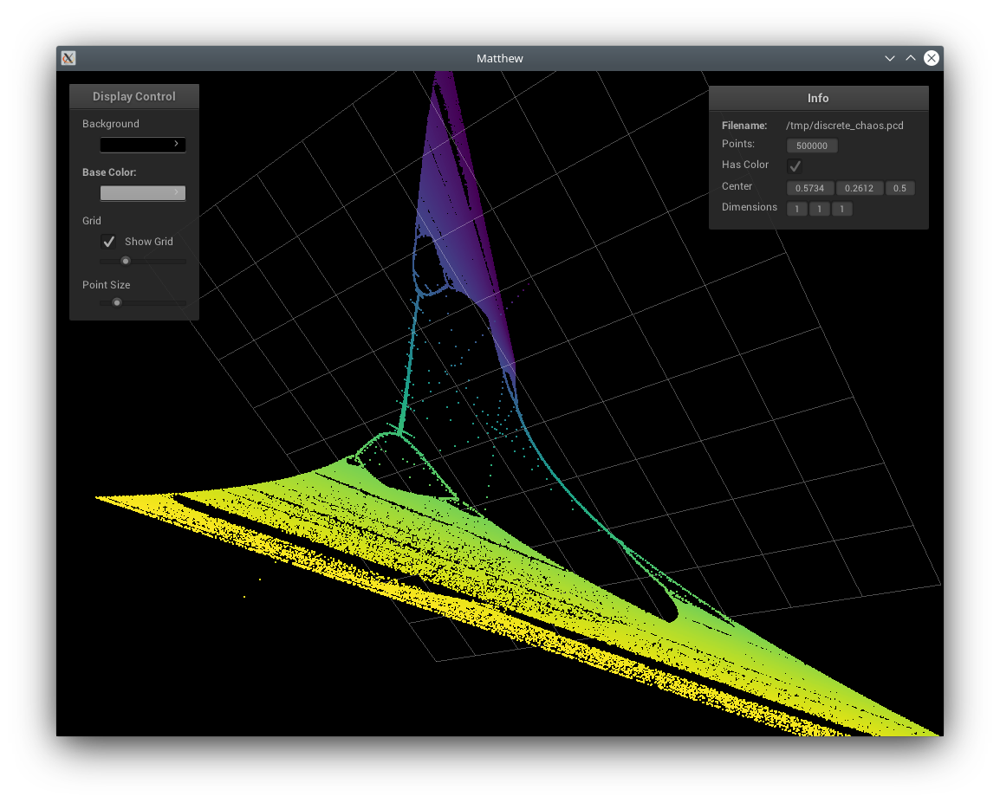

# Matthew

Hi, my name is Matthew :raising_hand:. I am a simple and performant mesh viewer based on [nanogui](https://github.com/wjakob/nanogui), [surface_mesh](https://www.labri.fr/perso/pbenard/teaching/surface_mesh/index.html) and openGL.
My task is to quickly show surface meshes to view the contents. I also compute basic mesh properties like curvatures
and I can remesh and improve meshes. Recently, point cloud support was added. I can now also show point clouds without structure information.

I can read:
 - Wavefront (_*.obj_)
 - Mesh (_*.msh_)
 - Object File Format (_*.off_)
 - STL (_*.stl_)
 - Point Cloud Data (*.pcd, ascii only)

## Matthew showing a bunny mesh

## Matthew for point cloud data 

### Matthew showing a Lorentz attractor trajectory

The data was generated using [this](scripts/lorentz.py) script.

### Matthew showing something strange

The data was generated from the [Hénon map](https://en.wikipedia.org/wiki/H%C3%A9non_map) varying the parameter b 
and keeping a=1.4 constant. It was generated in [this](scripts/discrete_chaos.py) script.

